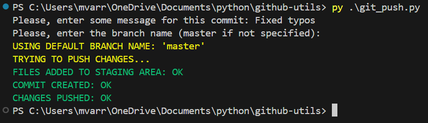

## git_push.py

This script automates the process of pushing all of the changes made to GitHub/GitLab via Git. 

### Process to be automated

Normally, this process involves the following steps:

1. Adding files to the staging area
    
    Command used to add all files to it: *git add .*
2. Commit changes using *git commit -m "some message"*
3. Finally, pushing changes using *git push -u origin master*

### How it works

This script requires user to input a commit message and a branch name. Afterward, if everything goes OK, all changes should be automatically pushed.

#### Notes

The script prompts for a commit message as a mandatory step and also prompts for a branch name which is a non-mandatory step: In case there is no input for it, Python will assume the value for the **branch_name_by_default** variable, defined in *git_push.py*, as the branch name to be used. Default value: master

### Exceptions handled

Code is capable of handling exceptions such as:

- KeyboardInterrupt: raised on pressing Ctrl+C
- subprocess.CalledProcessError: Deals with problems encountered during `subprocess.check_call()` execution. Related to problems that might occur when executing `git` commands

### Execution interruptions

The script will halt its execution under the following conditions:
1. **Git is not installed** on the system.
2. An error occurs while executing any of the following Git commands:
   - `git add`
   - `git commit`
   - `git push`
3. The user manually stops the execution by pressing `Ctrl + C`.

If an error occurs, the corresponding error message will be displayed and it will be appended to a file named `logs.txt` for future reference.

In case the `logs.txt` file is not present at the same directory level of *git_push.py*, a new one will be created automatically. In fact, it is created once *git_push.py* is executed
 
### Running the script

```python 
py .\git_push.py
```

You will be asked to enter a commit message (mandatory) and a branch name (optional, defaults to master)

### Example output

Your execution should be outputting similiar as follows:



### Latest improvements

- Added logging support