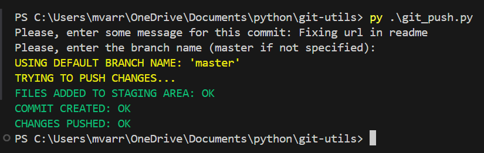

## Script

- [**git_push.py**](https://github.com/mvarrone/github-utils/blob/master/git_push.py)
    
    ### Main idea 
    It automates the process of pushing all of the changes to GitHub/GitLab via Git. 

    ### Process to be automated

    This process normally involves the following steps:

    a) **Adding files to the staging area:** *git add .*

    b) **Commit changes:** *git commit -m "message for this commit"*

    c) **Finally, pushing changes:** *git push -u origin master*

    ### How it works
    This script requires user to input a commit message and a branch name. Afterward, if everything goes OK, all changes should be automatically pushed.
    
    It proceeds with execution only after the user enters a message.
    
    It is capable of handling exceptions such as:

    - KeyboardInterrupt: Stops script execution on Ctrl+C.
    - subprocess.CalledProcessError: Deals with problems encountered during `subprocess.check_call()` execution. Related to problems that might occur when executing `git` commands.
    
    **Notes:** 
    
    - The script prompts for a commit message as a mandatory step.
    - It also prompts for a branch name which is a non-mandatory step: In case there is no input for it, Python will assume **branch_name_by_default** variable value, defined in code, as the branch name to be used.

### Running the script
```python 
py .\git_push.py
```
Then, you will be asked to enter a commit message and a branch name. If you do not provide a branch name, the script will select "master" as the desired one

# Example output

Your execution should be outputting similiar as follows:

